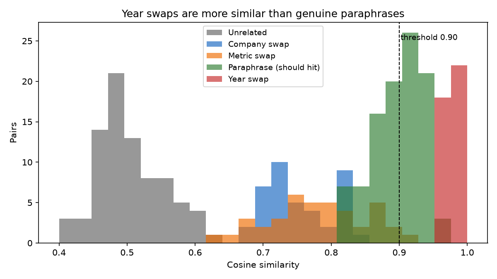
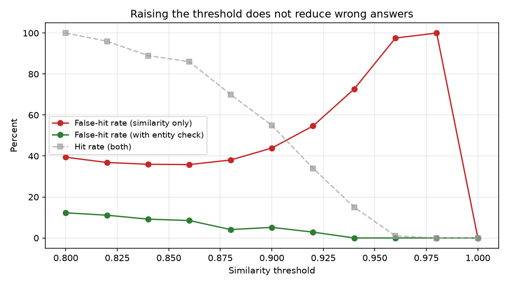

# LLM Cache Gateway

An OpenAI-compatible caching proxy for LLM APIs, plus a measurement of when semantic caching returns **wrong** answers.

## The problem

Semantic caches save money by reusing stored answers when a new question is "close enough" to one already answered. Closeness is embedding similarity against a threshold.

Every cache hit is a bet that two similar-looking questions have the same answer. When that bet loses, the system returns a confidently wrong answer — fast and cheap. The standard metric, hit rate, cannot detect this.

## Headline result

On a 300-pair labeled benchmark of SEC 10-K financial questions, at a similarity threshold of 0.90:

| | hit rate | false-hit rate |
|---|---|---|
| Similarity only | 55.0% | **43.9%** |
| With entity-aware invalidation | 55.0% | **5.2%** |

**Two in five cache hits returned the wrong answer.** Raising the threshold made it worse, not better — at 0.96 the cache almost never hits, and 97.6% of the hits it does get are wrong.

The cause: changing the fiscal year in a question makes it *more* similar to the original than rewording the same question does. Year swaps averaged 0.976 cosine similarity; genuine paraphrases averaged 0.904. No threshold separates them.

```
"What was Nvidia's gross margin in FY2023?"
"What was Nvidia's gross margin in FY2022?"     similarity: 0.9884
```



100% of year swaps leaked through at 0.90. Company swaps: 0%. The embedding model handles entity and topic changes correctly and is blind to temporal qualifiers.

Full analysis: [`results/FINDINGS.md`](results/FINDINGS.md)

## The fix

A deterministic check extracts fiscal year and company from both queries and forces a cache miss when either differs, regardless of embedding similarity. Layered over the similarity match, not replacing it.

Zero over-blocking on legitimate paraphrases, including pairs that write the year differently on each side (`FY2023` / `fiscal 2023` / `fiscal year 2023`).



## Usage

Start the gateway:

```bash
uvicorn app:app --reload
```

Point any OpenAI client at it:

```python
from openai import OpenAI

client = OpenAI(base_url="http://localhost:8000/v1", api_key="unused")

response = client.chat.completions.create(
    model="gpt-4o-mini",
    messages=[{"role": "user", "content": "What was Apple's revenue in FY2023?"}],
)
```

Cache statistics:

```bash
curl http://localhost:8000/stats
```

## Setup

```bash
python3 -m venv .venv && source .venv/bin/activate
pip install -e .
echo 'OPENAI_API_KEY=sk-...' > .env
```

## Reproducing the benchmark

```bash
python scripts/build_pairs.py         # regenerate the 300-pair labeled set
python scripts/embed_pairs.py         # compute pairwise similarities
python scripts/run_sweep.py           # baseline threshold sweep
python scripts/run_guarded_sweep.py   # sweep with entity-aware invalidation
pytest tests/
```

Embeddings are cached to disk keyed by SHA-256 of model and text, so only the first run makes API calls. Total cost is under one cent.

## Layout

```
app.py                      FastAPI proxy
cache/
  embeddings.py             embedding + cosine similarity, disk-cached
  store.py                  the cache itself
  invalidation.py           entity-aware blocking rules
benchmark/
  pairs.py                  load and validate the labeled set
  evaluate.py               threshold sweep and metrics
scripts/
  build_pairs.py            generate the benchmark
  embed_pairs.py            compute similarities
  run_sweep.py              baseline sweep
  run_guarded_sweep.py      guarded sweep
results/
  FINDINGS.md               full analysis
```

## Limitations

The metric-swap pairs in the benchmark are easier than intended — "total revenue" and "diluted earnings per share" are lexically distant enough that embeddings separate them without difficulty. A harder version would pair lexically similar but numerically distinct metrics (gross margin vs. operating margin, total assets vs. total liabilities). The residual 5% false-hit rate is entirely metric confusion.

The entity check is domain-specific: it knows about fiscal years and three company names. Generalizing it would mean either a broader extraction layer or an LLM-based field extractor, which trades latency for coverage.
